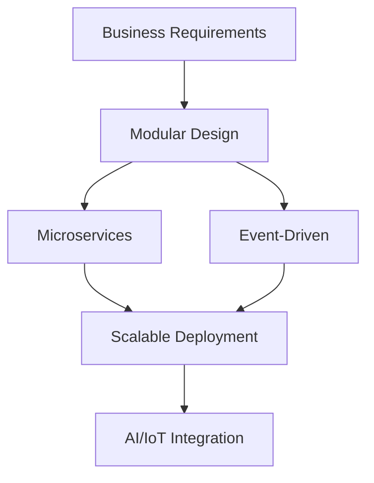
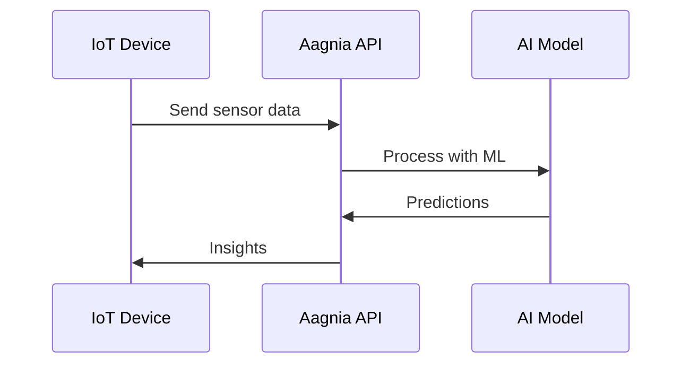

## Overview

Aagnia builds solutions starting from deep problem analysis through to scalable deployments. You identify business challenges, design robust architectures, and implement secure, AI-enhanced systems. This page covers the foundational concepts that drive Aagnia's approach to enterprise web, mobile, IoT, and AI solutions.

<Columns cols={3}>
  <Card title="Problem Analysis" icon="search" href="#problem-analysis">
    Identify and break down business challenges systematically.
  </Card>
  <Card title="Architecture Design" icon="layers" href="#architecture-design">
    Create scalable blueprints for complex systems.
  </Card>
  <Card title="Secure Development" icon="shield" href="#secure-development">
    Build with security and scalability from the ground up.
  </Card>
</Columns>

## Problem Identification and Analysis

Begin every project by pinpointing core issues. You gather requirements from stakeholders, analyze current processes, and map pain points.

<Steps>
  <Step title="Gather Requirements" icon="users">
    Conduct workshops and interviews to capture needs.

    ```bash
    # Example: Use tools like Miro for collaborative sessions
    npm install @mirohq/sdk
    ```
  </Step>
  <Step title="Analyze Data" icon="bar-chart">
    Review metrics and logs to quantify problems.
  </Step>
  <Step title="Prioritize Issues" icon="list">
    Rank challenges by impact using MoSCoW method.
  </Step>
</Steps>

<Callout kind="tip">
  Document findings in a shared repository to align teams early.
</Callout>

## Solution Architecture Design Principles

Design architectures that scale and adapt. Aagnia follows principles like modularity, resilience, and loose coupling.



<Tabs>
  <Tab title="Microservices" icon="server">
    Break applications into independent services.

    <CodeGroup tabs="Node.js,Python">
      ```javascript
      // Node.js service example
      const express = require('express');
      const app = express();
      app.get('/api/users', async (req, res) => {
        const users = await fetchUsers();
        res.json(users);
      });
      app.listen(3000);
      ```
      ```python
      # Python FastAPI service
      from fastapi import FastAPI
      app = FastAPI()
      @app.get("/api/users")
      async def get_users():
          return {"users": ["user1", "user2"]}
      ```
    </CodeGroup>
  </Tab>
  <Tab title="Event-Driven" icon="zap">
    Use Kafka or RabbitMQ for asynchronous communication.
  </Tab>
</Tabs>

## Scalable and Secure Development Practices

Implement practices that ensure systems handle growth securely. You containerize applications with Docker and orchestrate with Kubernetes.

<ParamField path="userId" param-type="string" required="true">
  Unique user identifier for secure access.
</ParamField>

<ParamField header="Authorization" param-type="string" required="true">
  Bearer `{YOUR_API_KEY}` for authentication.
</ParamField>

```javascript highlight="2-4,7" show-lines={true}
const axios = require('axios');

async function secureRequest(userId) {
  const response = await axios.get(`https://api.example.com/users/${userId}`, {
    headers: {
      'Authorization': `Bearer ${process.env.API_KEY}`
    }
  });
  return response.data;
}
```

<Callout kind="alert">
  Always validate inputs and use HTTPS to prevent vulnerabilities.
</Callout>

## Integration of IoT and AI Technologies

Combine IoT sensors with AI models for intelligent solutions. You stream data from devices to AI pipelines.

<Expandable title="IoT to AI Pipeline" default-open="true">



In Python, integrate with TensorFlow:

````python
import tensorflow as tf
from mqtt_client import subscribe_sensor_data

model = tf.keras.models.load_model('iot_model.h5')
data = subscribe_sensor_data('sensors/topic')
prediction = model.predict(data)
print(f"Prediction: {prediction}")
````

</Expandable>

## Best Practices for Enterprise-Level Deployments

Deploy with zero-downtime strategies and monitoring.

- Use CI/CD pipelines with GitHub Actions.
- Monitor with Prometheus and Grafana.
- Ensure multi-region redundancy.

<Columns cols={2}>
  <Card title="CI/CD Setup" icon="git-branch" href="/quickstart">
    Automate deployments for reliability.
  </Card>
  <Card title="Monitoring" icon="activity" href="/configuration">
    Track performance in real-time.
  </Card>
</Columns>

<ExpandableGroup>
  <Expandable title="Common Pitfalls" default-open="false">
    Avoid tight coupling between services. Test integrations early.
  </Expandable>
</ExpandableGroup>