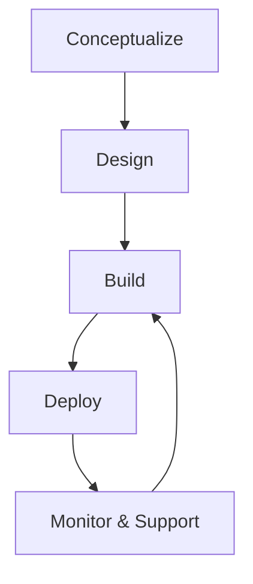

## Overview

Aagnia delivers end-to-end IT solutions that transform your business. You gain access to custom software development, enterprise web and mobile apps, industrial IoT implementations, and AI-driven integrations. These services help you conceptualize problems, design robust architectures, and deploy scalable solutions.

<Columns cols={3}>
  <Card title="Enterprise Web & Mobile" icon="smartphone" href="#enterprise-web-mobile">
    Build responsive applications that scale with your business needs.
  </Card>
  <Card title="Industrial IoT" icon="network" href="#industrial-iot">
    Connect devices and optimize operations with real-time data.
  </Card>
  <Card title="AI & Machine Learning" icon="brain" href="#ai-machine-learning">
    Integrate intelligent automation and predictive analytics.
  </Card>
</Columns>

## Custom Software Development Process

Follow Aagnia's structured process to turn ideas into production-ready software. You start with problem analysis and end with ongoing support.

<Steps>
  <Step title="Conceptualize" icon="lightbulb">
    Define requirements and map business challenges to technical solutions.
  </Step>
  <Step title="Design Architecture" icon="settings">
    Create blueprints for scalable, secure systems.
  </Step>
  <Step title="Build & Integrate" icon="code">
    Develop code with best practices. For example, integrate a REST API:

    <CodeGroup tabs="JavaScript,Python">
    ```javascript
    const response = await fetch('https://api.example.com/projects', {
      method: 'POST',
      headers: { 'Authorization': `Bearer ${YOUR_TOKEN}`, 'Content-Type': 'application/json' },
      body: JSON.stringify({ name: 'New Project', team: 'Engineering' })
    });
    const project = await response.json();
    console.log(project.id);
    ```
    ```python
    import requests
    headers = {
        'Authorization': f'Bearer {YOUR_TOKEN}',
        'Content-Type': 'application/json'
    }
    data = {'name': 'New Project', 'team': 'Engineering'}
    response = requests.post('https://api.example.com/projects', json=data, headers=headers)
    project = response.json()
    print(project['id'])
    ```
    </CodeGroup>
  </Step>
  <Step title="Deploy & Monitor" icon="rocket">
    Launch to production and track performance metrics.
  </Step>
  <Step title="Iterate & Support" icon="refresh-cw">
    Gather feedback and refine based on usage data.
  </Step>
</Steps>



## Service Breakdown

Dive into specific services with tailored examples.

<Tabs>
  <Tab title="Enterprise Web & Mobile" icon="globe">
    Develop cross-platform apps using modern frameworks.

    ```tsx
    // React Native example for mobile app
    import React from 'react';
    import { View, Text, Button } from 'react-native';

    export default function Dashboard({ user }) {
      return (
        <View style={{ flex: 1, justifyContent: 'center', alignItems: 'center' }}>
          <Text>Welcome, {user.name}!</Text>
          <Button title="View Projects" onPress={() => {}} />
        </View>
      );
    }
    ```

    <Callout kind="tip">
      Use responsive design for seamless web-to-mobile transitions.
    </Callout>
  </Tab>
  <Tab title="Industrial IoT" icon="cpu">
    Implement device connectivity and data pipelines.

    <CodeGroup tabs="Node.js,Python">
    ```javascript
    // MQTT client for IoT sensor data
    const mqtt = require('mqtt');
    const client = mqtt.connect('mqtt://broker.example.com');

    client.on('connect', () => {
      client.subscribe('sensors/temperature');
      client.publish('sensors/temperature', '23.5');
    });
    ```
    ```python
    # PyMQTT for device communication
    import paho.mqtt.client as mqtt

    client = mqtt.Client()
    client.connect('broker.example.com', 1883)
    client.publish('sensors/temperature', '23.5')
    client.subscribe('sensors/temperature')
    ```
    </CodeGroup>
  </Tab>
  <Tab title="AI & Machine Learning" icon="zap">
    Deploy models for predictive insights.

    ```python
    # Scikit-learn model for demand forecasting
    from sklearn.ensemble import RandomForestRegressor
    from sklearn.model_selection import train_test_split

    X_train, X_test, y_train, y_test = train_test_split(X, y, test_size=0.2)
    model = RandomForestRegressor(n_estimators=100)
    model.fit(X_train, y_train)
    predictions = model.predict(X_test)
    ```
  </Tab>
</Tabs>

## Business Transformation Use Cases

Aagnia powers real-world transformations:

- **Retail Optimization**: IoT sensors track inventory in real-time, integrated with AI for demand prediction.
- **Manufacturing Efficiency**: Custom web dashboards monitor equipment via IoT, reducing downtime by `>30%`.
- **Healthcare Innovation**: Mobile apps with ML analyze patient data for personalized care plans.

<Callout kind="success">
  Ready to transform? Start with a [quickstart](/quickstart) consultation to assess your needs.
</Callout>

<Expandable title="Advanced Integration Example" default-open="false">
  Combine services for full-stack solutions:

  ```javascript
  // Full pipeline: IoT data to AI endpoint
  async function processIoTData(sensorData) {
    const aiResponse = await fetch('https://api.example.com/predict', {
      method: 'POST',
      body: JSON.stringify(sensorData)
    });
    return aiResponse.json();
  }
  ```
</Expandable>