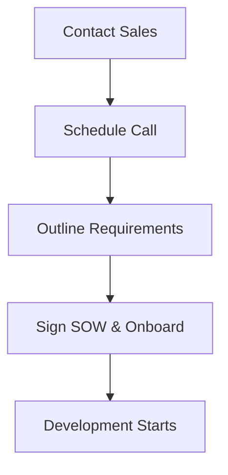

## Overview

Kick off your project with Aagnia Technologies quickly. As a leader in custom software development, IT services, enterprise web and mobile apps, industrial IoT, and AI solutions, Aagnia guides you from initial contact through onboarding. Follow these steps to transform your business needs into a tailored solution.

<Callout kind="info">
Before starting, prepare a high-level description of your project goals, target platforms (web, mobile, IoT), and timeline expectations. Gather any existing documentation or wireframes.
</Callout>

## Prerequisites

Ensure you have:
- A clear project idea or problem statement
- Contact details for your decision team
- Availability for a 30-minute consultation call

## 4-Step Quickstart Process

Follow these sequential steps to engage Aagnia.

<Steps>
  <Step title="Contact the Sales Team" icon="mail">
    Reach out via email or form to initiate discussions. Use a concise template to describe your needs.

    <CodeGroup tabs="Email,Contact Form">
      ````html
      Subject: Inquiry for Custom IoT Solution Development

      Dear Aagnia Team,

      We are interested in developing an industrial IoT platform for real-time monitoring. Key requirements:
      - Sensor data integration
      - AI analytics dashboard
      - Mobile app for alerts

      Best,
      [Your Name]
      ````

      ````html
      <form action="https://www.aagnia.com/contact" method="POST">
        <input name="name" placeholder="Your Name" required>
        <input name="email" type="email" placeholder="your@email.com" required>
        <textarea name="message" placeholder="Describe your project...">Industrial IoT platform with AI features</textarea>
        <button type="submit">Submit</button>
      </form>
      ````
    </CodeGroup>
  </Step>

  <Step title="Schedule Initial Consultation" icon="calendar">
    Reply to the sales response or book directly. Consultations cover feasibility, scoping, and high-level architecture.

    Expect a Zoom or Google Meet link within 24 hours. Prepare questions on timelines, costs, and tech stack (e.g., React for web, Flutter for mobile, AWS IoT Core).
  </Step>

  <Step title="Outline Project Requirements" icon="edit-3">
    During the call, collaborate on a requirements document. Aagnia provides templates for functional specs, user stories, and architecture diagrams.

    <Tabs>
      <Tab title="Web App" icon="globe">
        Focus on responsive UI, API integrations, and scalability.
      </Tab>
      <Tab title="Mobile App" icon="smartphone">
        Emphasize native/hybrid development, push notifications, offline support.
      </Tab>
      <Tab title="IoT/AI" icon="zap">
        Detail sensor protocols, data pipelines, ML models for predictive analytics.
      </Tab>
    </Tabs>
  </Step>

  <Step title="Onboarding Overview" icon="check-circle">
    Sign the SOW (Statement of Work), set up project tools (Jira, Slack, GitHub), and kick off with a sprint planning session.

    Your dedicated account manager handles access and aligns the team.
  </Step>
</Steps>



## Next Steps

<Columns cols={3}>
  <Card title="Explore Services" icon="book-open" href="/introduction">
    Dive into web, mobile, IoT, and AI offerings.
  </Card>

  <Card title="Case Studies" icon="bar-chart-3" href="/case-studies">
    See real-world transformations.
  </Card>

  <Card title="Contact Support" icon="headphones" href="https://www.aagnia.com/contact" target="_blank">
    Get immediate assistance.
  </Card>
</Columns>

<Callout kind="tip">
Ready to build? Your first project milestone is typically achieved in 2-4 weeks post-onboarding.
</Callout>